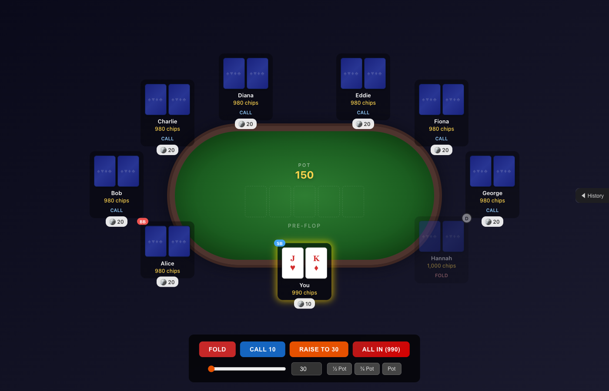
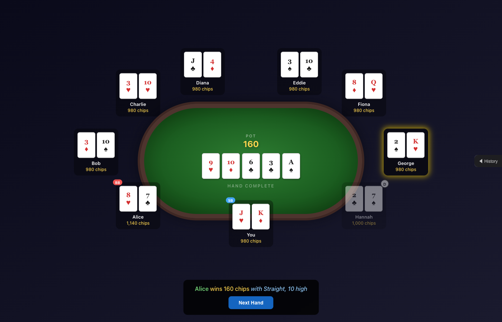

# Texas Hold 'Em Poker

A fully playable Texas Hold 'Em poker game built as a personal project to explore building software with [Claude Code](https://claude.ai/claude-code). The entire application — game logic, AI opponents, UI, and animations — was developed through collaboration with Claude.

## Screenshots





## About the Project

This project started as an experiment: how much faster could I re-build a previous hobby project now with Claude Code this time? The answer turned out to SIGNIFICANTLY faster.

The initial prompt that kicked things off can be found in [Prompts/Initial.txt](Prompts/Initial.txt), which also was initially generated by Claude (and then customized). Several enhancements and bug fixes were also completed after initial generation.

## Features

- **Full Texas Hold 'Em rules** — pre-flop through showdown with proper hand evaluation, kicker comparisons, and split pots
- **9-player table** — 1 human player vs. 8 AI opponents
- **AI decision-making** — opponents consider hand strength, position, pot odds, and stack sizes with randomized behavior
- **Side pot management** — correct pot distribution when players go all-in
- **Animated UI** — card dealing, chip movements, and showdown reveals
- **Hand history** — collapsible log of all actions taken during each hand
- **No external game libraries** — all poker logic built from scratch

## Tech Stack

- Angular 21
- TypeScript
- SCSS
- No backend — all game logic runs client-side

## Getting Started

```bash
cd Angular
npm install
npm start
```

Then open [http://localhost:4200](http://localhost:4200) in your browser.

## Project Structure

```
Angular/src/app/
├── models/          # Card, Player, GameState type definitions
├── services/
│   ├── deck.service.ts            # Shuffle and deal
│   ├── hand-evaluator.service.ts  # Hand ranking and comparison
│   ├── game-engine.service.ts     # Game loop, betting, pot management
│   └── ai.service.ts              # AI opponent decision-making
└── components/
    ├── table/         # Main game view
    ├── player/        # Individual player display
    ├── card/          # Playing card rendering
    ├── action-panel/  # Betting controls for the human player
    ├── hand-history/  # Action log sidebar
    └── game-over/     # End-of-game screen
```
